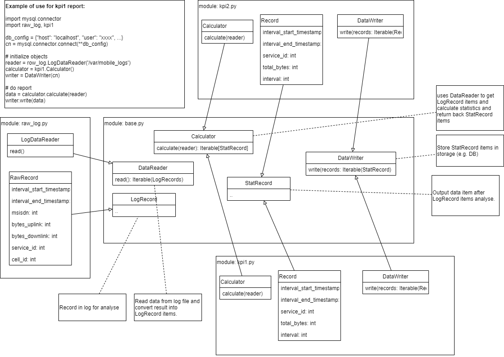

# Python Programming Challenge


## Requirements

* Python3.6
* Mysql
* sudo apt-get install default-libmysqlclient-dev  - required for mysqlclient lib.


## Install

It is stronlgy recommended to use `virtualenv`.

```
pip install -e .[dev]
```


### Setup DB

Run script [create_kpi_tables](db/create_kpi_tables.sql) in your DB to create necessary schema.


### Configuration

All application settings should be stored in settings.py file.
As settings.py can contain sensitive information (as password), the file is exluded from git.
Please copy `settings.py.example` to `settings.py` file and change necessary variables in `ppc` and `tests` folder.


## Tests

```
pytest
```

It is recommended to use test DB.

Attention: setup settings.py in `tests` folder.

### Fix pytest bug

Pytest has bug with mysql: https://github.com/pytest-dev/pytest/issues/5623

To fix it, please delete `site-packages/mysql-vendor` folder.


## Run

```
python -m ppc.main
```

Attention: setup settings.py in `ppc` folder.


## WebApp

Attention: copy `webapp/webapp/secret.py.example` to `webapp/webapp/secret.py` and put correct values.


### Run

```
python webapp/manage.py runserver 8080
```

### API documentation

[OpenAPI](docs/webapp_api.yaml)

You can use [Swagger Editor](https://editor.swagger.io/) to check the API doc.

Just copy-paste OpenAPI doc to the editor.

### Request example

```
https://localhost:8080/kpi1?limit=30&start_from=1488355200000
```


## Class diagram




## Modules

### base.py 


Define abstract classes.

1. `DataReader` - reads log records from data source (cvs in implementation) and returns list of LogRecords.
2. `Calculator` - uses DataReader to read input data and does statistic calculation.
3. `DataWriter` - Save output of `Calculator` to 


### kpi1.py

Implemention of Calculator and DataWriter for kpi1 report

### kpi2.py

Implemention of Calculator and DataWriter for kpi2 report


### raw_log.py

Implementation of DataReader for reading cvs files from


### main.py

Create process workflows for kpi1 and kpi2 reports using DataReader, Calculator and DataWriter from corresponded module.
